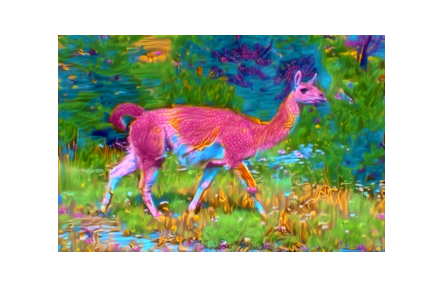
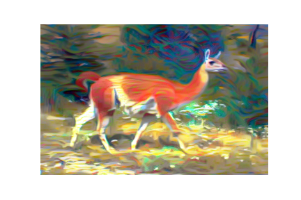
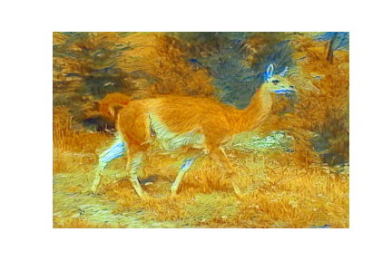

# Style Transfer

The repository contains a notebook for style transfer of a content and a style image. The notebook follows the tutorial from  [Udacity](https://classroom.udacity.com/courses/ud188/lessons/c1541fd7-e6ec-4177-a5b1-c06f1ce09dd8/concepts/af47e232-fa44-4e5d-b976-95e00430d0cf).

We *recreate* a style transfer method that is outlined in the paper, [Image Style Transfer Using Convolutional Neural Networks, by Gatys](https://www.cv-foundation.org/openaccess/content_cvpr_2016/papers/Gatys_Image_Style_Transfer_CVPR_2016_paper.pdf) in PyTorch.
The data for the style images used can be downloaded from [kaggle](https://www.kaggle.com/soumikrakshit/images-for-style-transfer), the content images are private.

